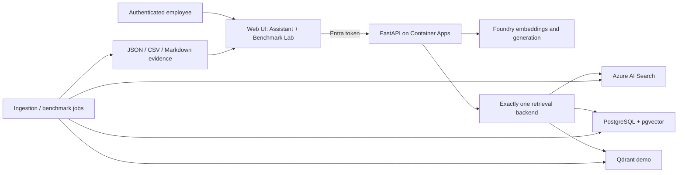

# Architecture

This document separates source implementation, deployed evidence and future work.

## Implemented in source

- Canonical synthetic corpus, deterministic chunks, ACL and effective-date metadata.
- Common retrieval interface and three adapters.
- Fair vector-only mode and an explicit platform-optimised mode: Azure hybrid plus semantic,
  PostgreSQL FTS plus vector fusion, and dedicated Qdrant dense/sparse vectors with RRF.
- Grounded generation, citations, refusal, Entra-protected `/ask`, and the Web Benchmark Lab.
- Enterprise-control evaluation, repeated metrics and raw evidence schemas.
- Terraform roots at `infrastructure/bootstrap` and `infrastructure/environments/dev`; Qdrant is
  defined in `infrastructure/environments/dev/qdrant.tf`.

## Deployed and previously live-verified

The Azure development deployment includes the Web UI, API, Foundry, all three retrieval services,
managed identities, ACR, Key Vault, private endpoints and monitoring. The authenticated Web flow
and one fair vector-only run per backend were verified. Versioned benchmark artifacts under
`benchmark_results/` are the evidence boundary.

## Implemented but not live-verified

- Repeated fair runs, enterprise controls, platform-optimised comparisons and current Lab changes.

## Future / externally blocked

- VNet-connected federated deployment runner and authoritative private-only Terraform refresh.
- Production-grade highly available Qdrant; the current Azure Files topology is a demo.
- Live execution and publication of the new benchmark tracks.

Power BI is out of scope. The Web UI is the only comparison dashboard. LangGraph is not used
because the implemented answer flow is linear and does not justify a graph runtime.
