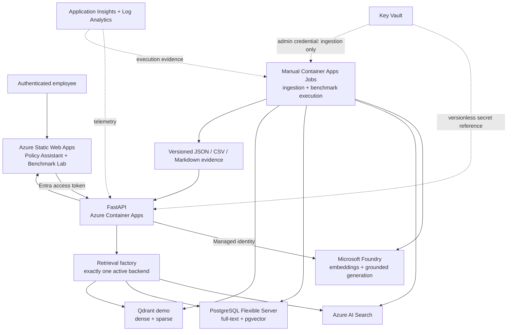

# Architecture

## Purpose

This project is an enterprise policy RAG reference implementation and retrieval benchmark. It
keeps one application contract while allowing Azure AI Search, PostgreSQL/pgvector, or Qdrant to
serve a request. `VECTOR_BACKEND` selects exactly one backend; the application never fans a user
query out to all three.

## Deployed topology

The development environment is Terraform-managed under `infrastructure/environments/dev`.
Bootstrap state resources are isolated under `infrastructure/bootstrap`. Qdrant infrastructure is
defined in `infrastructure/environments/dev/qdrant.tf`, not folded into a generic platform file.

## Application flow

1. The Web UI obtains an authorization-code-with-PKCE token from Microsoft Entra ID.
2. FastAPI validates issuer, audience, signature, delegated `Policy.Read` scope, and group claims.
3. The query is embedded with Microsoft Foundry using managed identity.
4. The retrieval factory selects one backend and applies ACL, department, effective-date, version,
   and optional document filters before returning evidence.
5. Foundry generates an answer only from the retrieved evidence. Unsupported questions are
   refused; supported claims carry document, version, section, and chunk citations.
6. Structured logs and correlation IDs support operational diagnosis without logging credentials.

## Retrieval contract

All adapters implement the same typed request/result contract:

- `src/policy_rag/retrieval/base.py`
- `src/policy_rag/retrieval/azure_ai_search_store.py`
- `src/policy_rag/retrieval/pgvector_store.py`
- `src/policy_rag/retrieval/qdrant_store.py`
- `src/policy_rag/retrieval/factory.py`

The common contract is deliberately smaller than any vendor SDK. Platform-specific capabilities
are enabled only by the explicit `platform-optimized` retrieval mode.

## Benchmark isolation

| Track | Controlled variables | Backend-specific behavior | Generation |
|---|---|---|---|
| Fair vector-only | Corpus, chunks, metadata, embeddings, cosine similarity, filters, questions and top-k | None | Excluded |
| Platform-optimised | Corpus, questions, access filters and top-k | Search hybrid + semantic; pgvector FTS + vector fusion; Qdrant dense + sparse RRF | Excluded |
| Enterprise controls | Synthetic cases and expected evidence | Same access/version contract on each backend | Included |
| End-to-end RAG | Representative questions, prompt and citation rules | One backend per run | Included |

Fair and platform-optimised results are stored in separate directories and validated as separate
modes. Raw artifacts retain every question, repetition, ranking, score, latency and metric. The
Benchmark Lab reads only schema-valid artifacts and shows “No benchmark completed” when none
exist; it never fabricates sample results.

## Security boundaries

- Azure data-plane calls use managed identity and RBAC; local/key authentication is disabled where
  the service supports it.
- Qdrant administrator and query credentials are distinct. The API receives the read-only secret
  only when Qdrant is selected; ingestion receives the administrator secret.
- Qdrant keys are generated as write-only Terraform values, stored in Key Vault, and consumed via
  Container Apps Key Vault references.
- Foundry, Search, Key Vault, ACR, PostgreSQL and storage are designed for private connectivity and
  private DNS. Storage blocks anonymous blob access.
- Application Insights accepts Entra-authenticated telemetry; local authentication is disabled.
- Synthetic policies and fictional identities are the only publishable data in the corpus.

See [Security](docs/SECURITY.md) for credential ownership, network controls, rotation and residual
development-environment limitations.

## Implementation and deployment status

Implemented and deployed: authenticated Web UI, FastAPI, grounded answering, all three retrieval
adapters, ingestion jobs, four benchmark tracks, Benchmark Lab artifact APIs, Terraform, CI/CD,
Key Vault integration, managed identities and monitoring.

Live benchmark evidence belongs under `benchmark_results/`; its schema-valid raw files and reports
are the authority for measured outcomes. Development-scale results are workload-specific and do
not establish a universal database winner.

Qdrant runs as a single-node demonstration deployment backed by Azure Files. It is suitable for
this benchmark, not a claim of production high availability. LangGraph is not used because the
implemented answer path is linear and does not justify a graph runtime. Power BI is intentionally
out of scope; the Web Benchmark Lab is the comparison dashboard.
